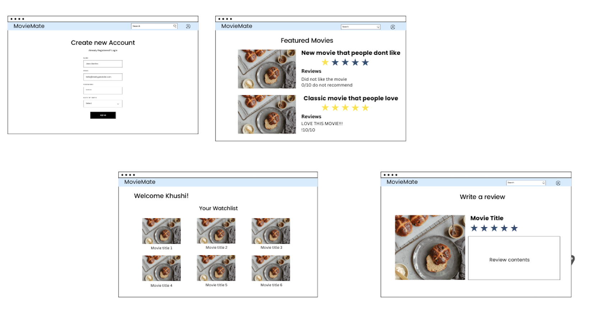
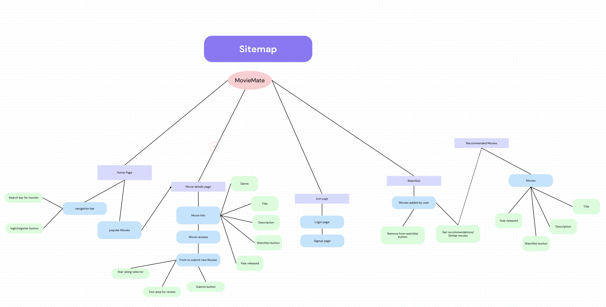

# MovieMate

## Overview

MovieMate is a web application that allows users to track and review movies they’ve watched. Users can add movies to their watchlist and receive personalized recommendations based on their viewing history.

Users can:
- Add movies to a **watchlist**.
- Submit reviews with **ratings and comments**.
- View movie details, including **aggregated ratings and reviews**.

---


## Data Model

The application will store **Users, Movies, and Reviews**.

- Users can maintain a **watchlist** (via references).
- Each movie can have **multiple reviews** (via references).
- Reviews will store **ratings and user comments**.

### **Sample Documents**

#### **User Schema**
```
{
  username: "moviefan23",
  email: "user@email.com",
  password: "hashed_password",
  watchlist: ["movie_id_1", "movie_id_2"],
}
```

Movie Schema
```
{
  title: "Inception",
  genre: ["Sci-Fi", "Thriller"],
  year: 2010,
  reviews: ["review_id_1", "review_id_2"]
}
```
Review Schema
```
{
  user: "user_id",
  movie: "movie_id",
  rating: 4.5,
  comment: "Amazing movie with mind-blowing visuals!",
  timestamp: "2025-03-20T12:00:00Z"
}
```

## [Link to Commented First Draft Schema](db.mjs) 

## Wireframes

The following wireframes illustrate the key pages of MovieMate, showing the layout of major elements such as **search, watchlist, review submission, and movie recommendations**.



📍 **View the full wireframes here:**  
👉 [Click to view Wireframes on Canva](https://www.canva.com/design/DAGiUhEPfIU/OSabKO46q5uX66Lo5OgUHA/edit)


## Site map

The following is the navigation flow of the MovieMate web application:



📍 **View the full site map here:**  
👉 [Click to view the Site Map on Canva](https://www.canva.com/design/DAGiUeR7b58/0etIr9gKU9KshS5yhgeQuw/view?utm_content=DAGiUeR7b58&utm_campaign=designshare&utm_medium=link2&utm_source=uniquelinks&utlId=h1307bcc5e2)

## User Stories or Use Cases

- As a **non-registered user**, I can **register an account**.
- As a **registered user**, I can **log in**.
- As a **user**, I can **search for a movie**.
- As a **user**, I can **add a movie to my watchlist**.
- As a **user**, I can **view my watchlist**.
- As a **user**, I can **submit a review and rating** for a movie.
- As a **user**, I can **view movie details**, including aggregated ratings.
- As a **user**, I can **receive movie recommendations** based on my watch history.

---
## Research Topics

For this project, I am researching and implementing **10 points worth of topics**:

### **(5 points) User Authentication**
- **Library Used**: Passport.js
- **Why?** Enables **secure user login & authentication**.
- **Implementation Plan**:
  - Users can **register and log in**.
  - Passwords will be **hashed** before storing in the database.
  - Pages requiring authentication will be **protected**.

### **(4 points) Client-Side Form Validation**
- **Why?** Ensures user inputs are **validated before submission**.
- **Implementation Plan**:
  - Prevents submission of **empty fields**.
  - Displays **error messages** for invalid inputs.
  - Example: Users **cannot submit a review without a rating**.

### **(3 points) Use Axios for Fetching Movie Data**
- **Library Used**: Axios
- **Why?** Simplifies API calls to fetch **real movie details** from OMDb API.
- **Implementation Plan**:
  - Use Axios to **fetch movie details** by title.
  - Create an API function to request data from OMDb.
  - Return JSON data to the frontend for **dynamic movie recommendations**.

---

## [Link to Initial Main Project File](app.mjs) 

[Main Page](./views/index.ejs)
- This project is set up using **Express.js**.
- Includes **package.json, app.mjs, models, and routes folders**.

---
## Annotations / References Used

Below are the key references used in building MovieMate:

1. [Passport.js Documentation](http://passportjs.org/docs) - Used for user authentication.
2. [Express.js Documentation](https://expressjs.com/) - Used for setting up the backend and handling routes.
3. [Mongoose Documentation](https://mongoosejs.com/) - Used for defining and interacting with MongoDB database schemas.
4. [OMDb API](https://www.omdbapi.com/) - Used for fetching movie metadata for recommendations and search functionality.
5. [Axios Documentation](https://axios-http.com/docs/intro) - Used for making API requests to fetch movie data dynamically.
6. [ESLint Documentation](https://eslint.org/docs/latest/) - Used for code linting and ensuring clean JavaScript code.


---
